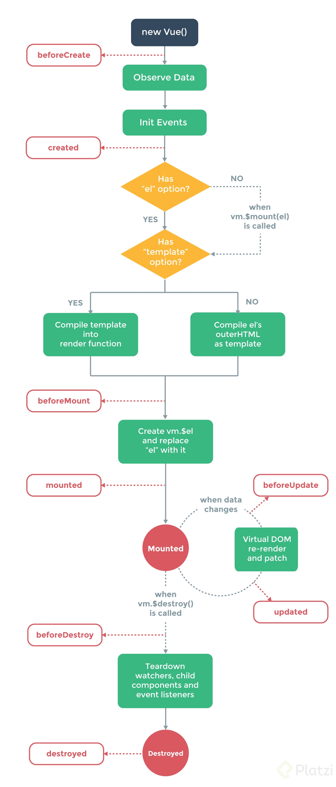

## Ciclo de vida de los componentes

#### 1. createApp y mount
Inicializa todos los eventos y funciones del ciclo de vida que veremos a continuaci&oacute;n.

#### 2. beforeCreate
Antes de que se inicie a crear el componente, se ejecuta el c&oacute;digo que se coloque dentro de esta funci&oacute;n.

#### 3. inyecciones y reactividad
En este punto ya se puede hacer uso de las funciones provide e inject, a si como de la reactividad de Vue.

#### 4. created
Una vez creada la definici&oacute;n del componente, ya que todav&iacute;a no existe en el DOM, ejecuta el c&oacute;digo que contenga la funci&oacute;n.

#### 5. template y options
En esta etapa se renderiza el template, ya sea el template componente HTML o el template JS de la API. 

#### 6. beforeMount
Ya renderizado el componente, justo antes de montarlo en el DOM podemos usar esta funci&oacute;n

#### 7. $el 
Aqu&iacute; se crea el elemento en el vDOM, obtiene esa referencia y se la va a asignar al componente para que pueda tener acceso a su propia definici&oacute;n en el DOM.

#### 8. mounted
En esta etapa ya podemos acceder a atributos del componente u otras parts de el, ya que, ya se encuentra creado.

#### 9. Ciclo Mounted - vDOM
Dentro de este ciclo Vue espera cambios cambios debido a la reactividad, eventos del usuario, etc. Antes de actualizar la vista primero:

###### 9.1 beforeUpdate
Podemos colocar el c&oacute;digo que requiera datos del componente antes de hacer el cambio.

###### 9.2 vDOM re-rendered and patch
Aqu&iacute; se realiza el cambio y l actualizaci&oacute;n del DOM y lo renderiza.

###### 9.3 update
En esta func&oacute;n se coloca lo que deseemos realizar despu&eacute;s de re-renderizar y parchar el DOM.

#### 10. beforeUnmount
A veces requerimos remover un componente por X o Y raz&oacute;n. Al remover un componente, este desaparece dejandonos sin acceso a este. Por tanto, esta funci&oacute;n nos da el &uacute;ltimo acceso al componente ya sea para reiniciar alguna variable, eliminar referencias a datos externos, cerrar alguna conexi&oacute;n con servidor, etc.

#### 11. Unmounted
Es cuando un componente deja de existir en memoria. Ya no podemos acceder a este componente.

#### 12. unmounted
Se colocan las instrucciones que se har&aacute;n cuando el componente desaparezca. Normalmente se usa para notificar a otros componentes que este ya no esta disponible.

## Resumen



## Ejemplo

A continuaci&oacute;n podemos ver el componente LifecycleHooks.vue que hace uso de algunas funciones del ciclo de vida para imprimir mensajes en consola y mostrarnos en que punto ya es posible acceder al componente y sus datos.

#### LifecycleHooks.vue

```html
<template>
  <h2>Lifecycle Hooks</h2>
  <div>{{ text }}</div>
</template>

<script>
export default {
  name: "LifecycleHook",
  data() {
    return {
      text: "Hola Vue",
    };
  },
  beforeCreate() {
    console.log("beforeCreate", this.$data, this.$el);
  },
  created() {
    console.log("created", this.$data, this.$el);
  },
  mounted() {
    console.log("mounted", this.$data, this.$el);
  },
};
</script>
```

#### App.vue

```html
<template>
  <LifecycleHooks />
</template>

<script>
import LifecycleHooks from "./components/LifecycleHooks";

export default {
  name: "App",
  components: {
    LifecycleHooks,
  },
};
</script>
```
