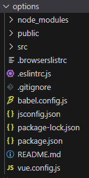

## Identificando partes del proyecto

1. **package.json:** Contiene dependencias y scripts de nuestra aplicaci&oacute;n.
1. **package-lock.json:** Contiene las versiones que requiere de las dependencias nuestra aplicaci&oacute;n.
1. **readme.md:** Contiene las instrucciones para trabajar, construir el proyecto.
1. **babel.config.js** Permite configurar babel.
1. **.gitignore:** Permite ignorar archivos y carpetas que no requieras subir al repositorio.
1. **.eslintrc.js** Permite configurar el linter.
1. **.browserlistrc:** Contiene las versiones de navegadores con las que puede trabajar nuestra app.
1. **node_modules:** Carpeta que contiene los archivos de las dependencias que requerimos en el package.json.
1. **public:** Carpeta que est&aacute; en un servidor de archivos estaticos al ejecutar nuestro proyecto, esto se debe a que "por debajo" usamos webpack dev server.
1. **scr:** Carpeta donde colocaremos los archivos que vamos a estar trabajando. 

## Carpeta src

1. **assets:** Contiene imagenes, fuentes y recursos que no son texto plano.
1. **components** Carpeta que contiene archivos .vue que conforman otras vistas o pueden ser reutilizados. 
1. **App.vue** Es la vista principal de nuestra aplicaci&oacute;n.
1. **main.js** Es el archivo que monta nuestra aplicaci&oacute;n vue.

En esta carpeta podemos implementar la estructur arquitectura que querramos, excepto por el archivo `main.js` el cual se encarga de montar la app vue e indirectamente encontrar webpack.