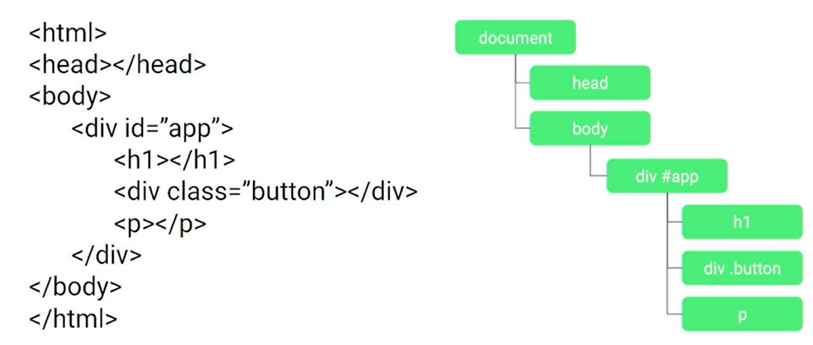

## Document Oobject Model (DOM)

Como vemos en la imagen, el DOM se contruye en forma de &aacute;rbol, tomando nuestro HTML como base.

## Virtual Documento Object Model (VDOM)

Es la t&eacute;cnica que usa Vue. En lugar de pasar directamente el HTML al DOM, lo que hace es elaborar una capa intermedia de objetos JavaScript. El usar objetos para posteriormente actualizar el DOM tiene un mayor rendimiento vs el actualizar el DOM usando funciones que nos brinda JavaScript.

Los componentes de Vue no son m&aacute;s que elementos del vDOM. Despu&eacute;s de obtener todos los cambios en el vDOM Vue procede a actualizar el DOM. 